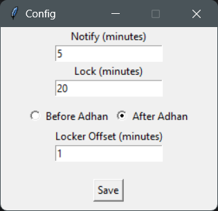

# prayer-pause

prayer-pause is a desktop (mainly Windows) background app that fetches daily prayer times for your current location, shows adhan
reminders before each prayer, and opens a temporary full-screen lock screen during prayer time.


<p align="center">
  
</p>


##  ️Features

- Automatically detects your city and country from your public IP
- Auto start at user log-in (can be disabled)
- Fetches today’s prayer times from [AlAdhan API](https://aladhan.com/prayer-times-api)
- Sends a reminder notification before each prayer
- System tray menu to update settings


## Installation & Setup

### Standalone Executable

1. Download the latest `.exe` from the [Releases](https://github.com/cqveman/prayer-pause/releases) page.
2. Run the `prayer-pause.exe`.
3. You're all set!

You can change the settings via the tray icon.

### Manual Installation

#### 1. Clone the repository
```bash
git clone https://github.com/cqveman/prayer-pause.git
```
```bash
cd prayer-pause
```

#### 2. Activate virtual environment
```bash
python -m venv .venv
.venv\Scripts\activate
```

#### 3. Install dependencies
``` bash
pip install -r requirements.txt
```

#### 4. Run
``` bash
python prayer_pause\main.py
```


## Configuration

### Config file location `%APPDATA%/PrayerPause/config.json`

Use tray menu **Settings**:

- `Notify (minutes)`: Time before prayer to show the adhan reminder.
- `Lock (minutes)`: Lock screen duration at prayer time.
- `Locker Offset (minutes)`: Set the locker to be executed before/after the adhan by X minutes. 
- `Before Adhan` and `After Adhan`: Radio buttons for the Locker Offset.

> **Note:** `Notify` and `Lock` values must be greater than `0`.

### Auto start

To disable start up on user log in:

1. Open the task manager.
2. Go to the "Startup apps" menu.
3. Select `prayer-pause.exe` and press Disable in the top right corner.

> **Note:** It also can be removed entirely from the "Registry Editor" at the location `HKEY_CURRENT_USER\Software\Microsoft\Windows\CurrentVersion\Run`.


## Packaging / distribution

The project uses `PyInstaller` for building executables.

Example using the included `.spec` file:

```bash
pyinstaller --clean prayer-pause.spec
```

If you encounter issues with the `.spec` file, you can delete it and run:

```bash
pyinstaller --clean --onefile --windowed --add-data "app.ico;." --hidden-import plyer.platforms.win.notification --icon=app.ico --name prayer-pause --paths src src/prayer_pause/main.py
```


## TODOs
- [x] ~~Auto start on system login (Windows)~~.
- [ ] Auto start on system login (Linux).
- [ ] Offline mode.


## Troubleshooting

If you encounter unexpected behavior:  

- Verify your system date, time, and timezone.
- Ensure network access to APIs.
- Open **Settings** and re-save to reload the scheduler.
- Delete `config.json`; the app will regenerate it with default values on the next start.
- Ensure saved values are positive integers.

If the issue persists, feel free to open an [issue](https://github.com/cqveman/prayer-pause/issues)


## Contributing

plz vro open a pr 🥀💔✌🏽


## License

MIT
